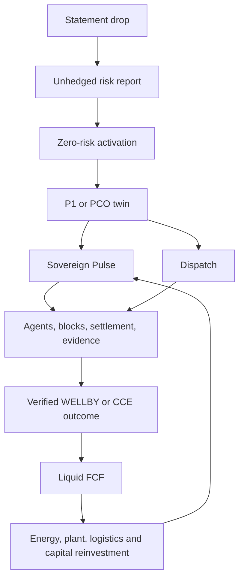

# From Fragmented Survival to Visual Sovereignty
## A chronological executive script and developmental case study

## How to read this document
This is the narrative of the P1/PCO programme as an evolving design argument. It is not a claim that every commercial assumption has been validated. It distinguishes observed problem framing, conceptual hypotheses, illustrative calculations, rejected alternatives, and the operating architecture eventually expressed in the prototype.

## Prologue — The problem was not a lack of information
The starting point was economic fragmentation. A household can have income, bills, debt, health signals, energy use, and latent capabilities, yet experience them as disconnected tasks. A company has the same pattern at larger scale: balance sheet, P&L, procurement, workforce, supply chain, energy, and environmental obligations are managed by separate systems and teams. Both spend disproportionate effort surviving the present rather than allocating capital toward a better future.

The first question was therefore not “How do we build another dashboard?” It was: “What operating unit can see the whole economic organism, identify its constraints, and dispatch action?”

## Stage 1 — Define the two subjects
The design introduced two persistent virtual entities:

- P1, the virtual person or household: a living economic twin of a person’s or household’s inflows, outflows, survival floor, risks, health and vitality, assets, and goals.
- PCO, the virtual company: an operating twin of a company, site, team, or supply-chain unit, including its revenue, costs, working capital, workforce conditions, risks, and improvement opportunities.

The important move was to treat these as operating subjects, not merely profiles. A profile describes. A twin can maintain state, compare state to a target, and dispatch a mission.

### The initial rejected alternative: passive welfare monitoring
A passive “survival dashboard” was deliberately rejected as insufficient. Showing a person that they are short of cash, or a company that its margin is shrinking, does not itself create agency. The system had to move from telemetry to capital allocation and execution.

## Stage 2 — The isomorphism breakthrough
The next debate asked whether the household and enterprise models were actually different. At the accounting surface they are different legal objects; at the operational surface they share a structure:

1. A starting balance sheet and a flow statement.
2. Fixed and variable commitments.
3. A minimum survival or continuity floor.
4. Risks that can be hedged, pooled, or eliminated.
5. Assets that produce future flows.
6. A need to convert insight into executed action.
7. A feedback loop from realised cash and outcomes.

This is the P1/PCO isomorphism. The same control logic can operate on both: establish identity and baseline, calculate constraints, select an outcome, dispatch an intervention, verify evidence, and reinvest realised value. P1 is people-facing; PCO is enterprise-facing. The abstraction is shared even where the data, law, and outcome metric differ.

This reframed the opportunity from “financial advice for consumers” or “enterprise software” into a sovereign operating layer for economic entities.

## Stage 3 — From passive survival to strategic allocation
The model then evolved from a cash-survival tool into a strategic capital allocator. Survival remains a hard constraint, but the objective is to create optionality:

- reduce avoidable leakage;
- aggregate purchasing power;
- turn fragmented demand into wholesale blocks;
- convert verified outcomes into recurring value;
- route free cash flow into productive physical assets; and
- use lower internal costs to widen the next spread.

For a P1, this might mean the survival floor, non-wage income, health, energy and household costs. For a PCO, it might mean margin expansion, supply-chain resilience, workforce vitality, energy procurement, and decarbonisation. The system is not “optimising a spreadsheet”; it is allocating scarce capital against a hierarchy of outcomes.

## Stage 4 — The gross-up thought experiment
A decisive iteration made the economics concrete through domestic utilities. Suppose a person needs £3,600 net per year to pay domestic utilities and faces a 40% marginal income-tax rate. If the utilities must be funded from post-tax income, gross income G must satisfy:

`G × (1 - 0.40) = £3,600`

Therefore:

`G = £3,600 / 0.60 = £6,000`

The gross-up itself is £2,400 of tax at that simplified rate. A later programme scenario used the figure £6,207 as the required gross income. That figure is not produced by the simple 40% equation alone: £6,207 × 60% equals £3,724.20. It must therefore represent additional assumptions, such as National Insurance, thresholds, allowance treatment, a different marginal effective rate, or a grossed-up employment-benefit calculation.

The general formula remains:

`gross = net / (1 - applicable effective rate)`

So, to produce exactly £3,600 net from £6,207, the implied effective burden is approximately 42.0%:

`1 - £3,600 / £6,207 ≈ 0.420`

This distinction became part of the design discipline: never present an illustrative number as if it followed from a different simplified assumption.

### Why the corporate BIK route matters
The strategic insight was that the same real-world utility can have a radically different cost depending on the payment architecture. If an employer provides or pays for a benefit, the benefit-in-kind and payroll rules determine the taxable value and who bears which charge. A corporate structure may collapse some of the friction that exists when an individual first earns gross cash, pays tax, and then pays the bill.

This is not a universal tax arbitrage and not tax advice. ITEPA 2003 section 204 concerns the valuation of benefits provided by reason of employment; the exact treatment depends on the benefit, exemptions, payroll handling, NIC, and the relevant tax year. The insight is architectural: route the same outcome through the structure that minimises unnecessary gross-up, while documenting the legal classification and validating it professionally.

## Stage 5 — Occam’s razor onboarding
The next breakthrough was onboarding. A comprehensive data import was rejected because it would make the product useful only after a large amount of work. The minimum viable sequence became:

1. Statement drop — the person or company gives a plain statement of reality: bills, risk, objective, or operational pain.
2. Unhedged risk report — the twin converts that statement into a legible exposure map: what is exposed, what it costs, what could change, and what remains unknown.
3. Zero-risk activation switch — the user can activate an intervention whose downside is bounded and whose success can be measured.
4. Evidence and expansion — once value is demonstrated, richer telemetry and broader missions become justified.

Earlier descriptions called the second and third moments “virtual twin activation” and “zero-risk outcome activation.” The refined version makes the unhedged-risk report explicit: the user should first see the cost of inaction and the shape of the hedge before being asked to configure a complex system.

### Rejected alternative: full-stack onboarding first
A conventional approach would request bank feeds, accounting integrations, health data, procurement contracts, and organisational permissions up front. It was rejected because it confuses data completeness with customer value. The system should earn permission by solving a bounded problem.

## Stage 6 — Two surfaces, one operating loop
The interface then separated observation from execution.

### Surface A: Sovereign Pulse
The Pulse is the real-time state surface. It carries:

- survival or continuity floor;
- balance-sheet position;
- inflows and outflows;
- free-cash-flow ticker;
- savings and commitments;
- risk and resilience indicators;
- health/vitality telemetry where appropriate; and
- the direction of travel.

It should feel calm, legible, and sovereign. Its job is to answer “What is true now?”

### Surface B: Dispatch
Dispatch is the action surface. It carries:

- autonomous agents and their missions;
- active work and blockers;
- wholesale block aggregation;
- supplier or customer coordination;
- settlement state;
- evidence of completion;
- expected value and realised value; and
- the next decision requiring human authority.

Its job is to answer “What changes next, and how does it settle?”

### Operating mechanics
Pulse detects a gap or opportunity. Dispatch decomposes it into a mission. The system aggregates compatible demand into a block, negotiates or executes against that block, records settlement, verifies the outcome, and writes the realised cash and telemetry back into Pulse. This is the control loop that turns a dashboard into an operating system.

## Stage 7 — Choosing the North Stars
The programme separated the human and corporate definitions of value.

### P1 North Star: WELLBY
For people, the north star is WELLBY: the change in wellbeing associated with life satisfaction and healthy life years. The design discussions used an illustrative planning value of roughly £150–£250 per WELLBY. The metric prevents the system from optimising cash while degrading lived experience.

### PCO North Star: CCE
For companies, the north star is cash conversion efficiency:

`CCE = free cash flow / gross operating profit`

The target discussed was above 80%. CCE prevents revenue growth, accounting profit, or a green claim from being mistaken for cash-generating operational health.

The two metrics are analogous but not interchangeable: WELLBY measures human flourishing; CCE measures the conversion of operating performance into deployable cash.

## Stage 8 — The seven-tier value taxonomy
The taxonomy expanded the product beyond a narrow finance tool. The tiers are a map of where measurable value can arise and be monetised:

1. Energy — supply, cost, clean-energy offtake, and internal levelised cost of energy.
2. Shelter and plant — buildings, equipment, occupancy, maintenance, and productive physical capacity.
3. Health and vitality — biological age, visceral fat, sleep, metabolic markers, no-additives nutrition, and biomarker tracking. These are outcome categories requiring consent, careful measurement, and medical boundaries; they are not promises of diagnosis or treatment.
4. Climate and externalities — Scope 1–3 reduction, local pollution, clean energy, avoided damage, and positive community externalities.
5. Nutrition and COGS — food, inputs, procurement, waste, quality, and cost of goods sold.
6. Mobility and logistics — transport, freight, routing, utilisation, and wholesale movement.
7. Capital and identity — cash conversion, reinvestment, ownership, identity, and programmable settlement. The technical vocabulary explored here included Nostr for identity/event distribution, DuckDB for analytical local state, and x402-style machine settlement. These are implementation candidates, not commitments to a single stack.

The P1 column emphasises economic floor, health/vitality, and environmental contribution. The PCO column emphasises margin expansion, workforce vitality, supply-chain resilience, and ecological handprint. Both can participate in all seven tiers.

## Stage 9 — Server-to-Cash Multiplier
The economic model then tested whether a small digital operating cost could control a much larger outcome surface. The scenario used one Hetzner EX44 server as a unit of infrastructure and explored approximately £750–£900 net FCF to Kanay per £1 of annual server spend.

The mechanism was not raw hosting resale. It was the combination of:

1. low marginal compute cost;
2. many P1 and PCO twins on a shared operating layer;
3. outcome-based spreads rather than only seat pricing;
4. wholesale block aggregation across fragmented demand; and
5. settlement and reinvestment that compound the advantage.

The correct interpretation is a planning hypothesis, not a guaranteed return. It must be tested against server price, utilisation, support, acquisition cost, payment costs, tax, bad debt, outcome verification, and the share of value retained by Kanay. Earlier visual models also used illustrative P1 revenue of £720 per year, PCO revenue of £6,150 per year, and blended planning ranges of £800–£1,200 revenue per £1 of spend. These scenarios should be versioned and sensitivity-tested rather than treated as forecasts.

## Stage 10 — Screen lifecycle and feedback iterations
The screen design progressed in the same order as the operating argument:

1. Statement — give the system a human-readable starting point.
2. Risk — show unhedged exposure and the cost of inaction.
3. Activation — offer a bounded, low-risk switch.
4. Pulse — make the live state legible through balance-sheet, FCF, and telemetry signals.
5. Dispatch — show agents, missions, wholesale aggregation, and settlement.
6. Risk and controls — expose uncertainty, limits, and intervention authority.
7. Spawner — make the creation of additional P1s/PCOs and operating capacity visible.

Feedback repeatedly pushed the screens away from generic dashboards and toward a coherent lifecycle. The design had to make the first useful action obvious, distinguish state from action, show economic consequences, and avoid pretending that an autonomous agent had authority it did not possess.

## Stage 11 — Visualisation and prototype
The visual suite consolidated the argument into six artefacts:

- P1/PCO virtual-economy architecture: onboarding plus Pulse and Dispatch.
- Kanay corporate economics: acquisition funnel, dual revenue stream, margin waterfall, and capital flywheel.
- Kanay unit multiplier: server cost, P1/PCO revenue, and monetisation categories.
- Complete value taxonomy: P1/PCO columns, seven value areas, WELLBY and CCE.
- Cash-to-cash reinvestment flywheel: liquid FCF, high-ROCE assets, lower internal LCOE, wider spreads, more FCF.
- Unified Kanay operating architecture: the full picture linking twins, operating layer, outcomes, unit economics, and reinvestment.

The interactive prototype then made these ideas navigable rather than merely presentational. Its lifecycle screens include statement, activation, pulse, dispatch, risk, and spawner. The deployment effort established the canonical private Poke project `p1-pco-lifecycle`; this repository preserves the narrative, architecture, source inventory, and media references.

## Stage 12 — What the final system is
The final architecture is a sovereign economic operating system:

In plain language: start with a statement, expose the unhedged risk, activate a bounded intervention, observe the sovereign state, dispatch the next action, settle it, verify the outcome, and reinvest the cash. P1 and PCO are two expressions of the same operating grammar.

## Closing principles
1. Start from the minimum useful statement, not maximum data collection.
2. Keep survival visible, but optimise for strategic optionality.
3. Treat household and enterprise economics as isomorphic control problems where appropriate.
4. Separate state from action: Pulse is not Dispatch.
5. Use WELLBY for human value and CCE for corporate cash efficiency.
6. Treat tax and multiplier numbers as assumption-led models requiring validation.
7. Aggregate fragmented demand before attempting to capture spread.
8. Make autonomy auditable: every agent action needs authority, evidence, settlement, and a measurable outcome.
9. Reinvest realised FCF into productive capacity so the system compounds rather than merely reports.
10. Let each iteration make the next action clearer for a person, a company, and the developer implementing the system.
