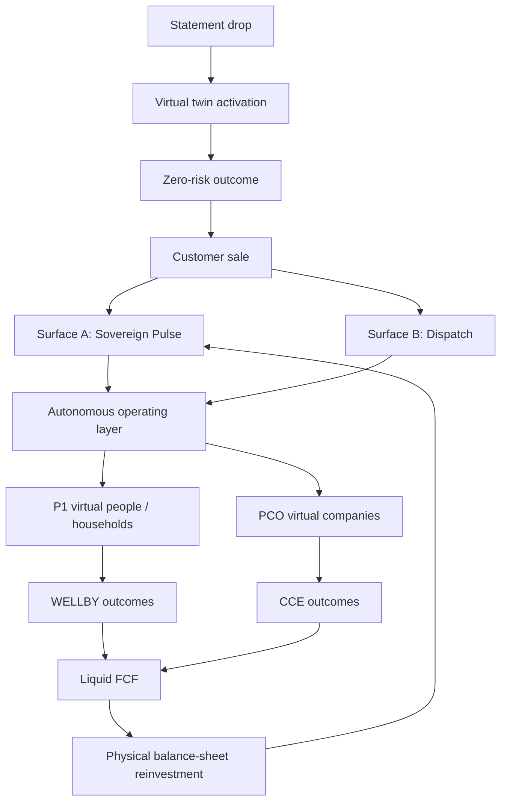

# Unified operating architecture

## Seven-tier value taxonomy
The seven-tier model is a progression from individual/household economic reality through health, environment, and enterprise outcomes, with monetisation across every tier:

1. Economic floor: wealth floor, non-wage income, margin expansion, sovereign resilience.
2. Health and vitality: biological age, sleep, metabolic health, longevity, zero burnout.
3. Climate and environmental contribution: net-zero footprint, pollution reduction, clean-energy offtake.
4. Workforce and occupational environment: safer, healthier, more productive work.
5. Ecological handprint: Scope 1–3 decarbonisation, biomethane displacement, circular loops.
6. Infrastructure and resilience: energy, shelter/plant, logistics, supply continuity.
7. Capital and compounding: cash conversion, reinvestment, asset ownership, durable sovereignty.

P1 primarily expresses people/household outcomes; PCO primarily expresses company/site outcomes. Both can create value in all tiers.

## North stars
WELLBY measures life satisfaction plus healthy life years; the referenced planning range is £150–£250 per WELLBY. CCE (cash conversion efficiency) is FCF / gross operating profit, with a target above 80%.
