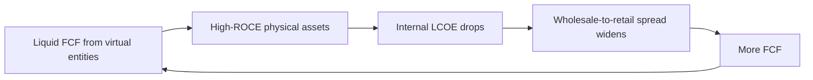

# Economic architecture and unit economics

## Revenue architecture
Kanay uses two streams:
- Base sovereign infrastructure fee: recurring fee for the operating system, data layer, twin, and core capability.
- Outcome-based success fee: variable fee linked to verified improvements and realised value.

Illustrative visual planning case: 10,000 P1s and 1,000 PCOs, £13.35M ARR and £10.1M EBITDA. These are scenario figures, not audited forecasts.

## Unit multiplier
The visual model uses approximately £1.50 server cost per tenant per year and illustrates:
- P1 revenue/entity: £720/year.
- PCO revenue/entity: £6,150/year.
- Implied server-spend revenue range: approximately £480–£4,100 per £1.
- Blended planning range: £800–£1,200 revenue per £1 of spend.

These figures are assumptions for modelling and must be revalidated against live pricing, hosting, support, sales cost, taxes, and customer outcomes.

## Reinvestment flywheel

The physical categories referenced by the visual suite include biomethane, hydro, solar, energy, shelter/plant, nutrition/COGS, mobility/freight, and capital/finance.
